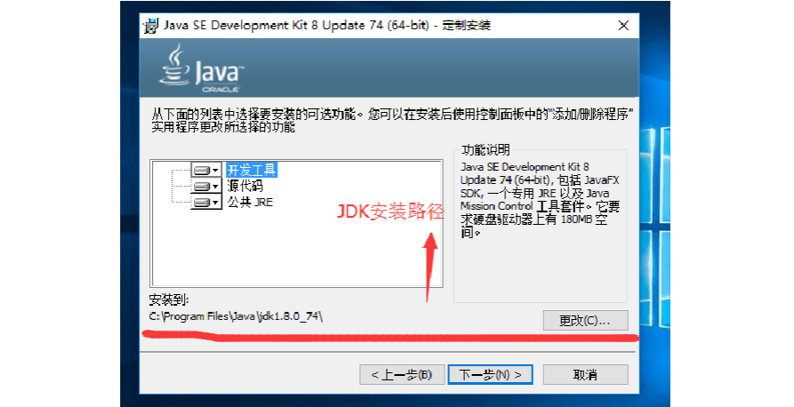
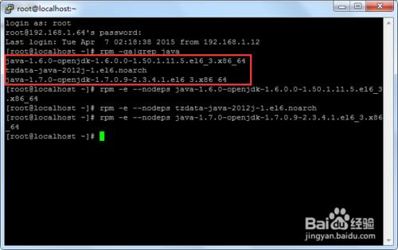

<!-- TOC -->

- [jdk安装](#jdk安装)
    - [安装jdk](#安装jdk)
    - [环境变量配置](#环境变量配置)
    - [测试](#测试)
- [Helloworld](#helloworld)

<!-- /TOC -->

# 1. jdk安装

## 1.1. 安装jdk
安装JDK 选择安装目录 安装过程中会出现两次 安装提示 。第一次是安装 jdk ，第二次是安装 jre 。建议两个都安装在同一个java文件夹中的不同文件夹中。（不能都安装在java文件夹的根目录下，jdk和jre安装在同一文件夹会出错）  

  



## 1.2. 环境变量配置

## 1.3. 测试

# 2. Helloworld

## 基本代码
```
package river.cn.Main
public class A{
public static void main(String[] a){
	System.out.println("hellowold");
}
}
```

## 测试  

